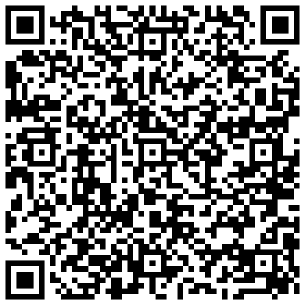

# Mattio-cmd

free software enjoyer

- EE & CS

### Operating Systems

### Programs & Others

### Programing Languages I have used
No particular order.

### Some of the things i have made:
(WIP)

[dotfiles](https://github.com/Mattio-cmd/dotfiles)
  - My dotfiles used for a complete modern desktop experience.

### DONATE
8C7LVn9tbxt13kb5Pc5JgfjPrMy7V9EU3dMcYZ84BsfqfRFwVZwssDkCrjyDAWsUFVPTdr4av3jvCaqNQsYfCHs6LtjdWU4

